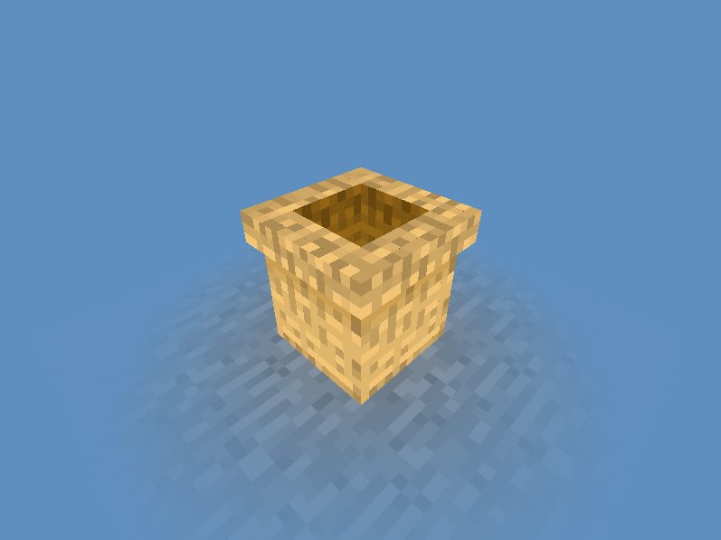

# JSON Model Viewer

Provides a quick and easy way to display and visualize models in the dreaded .json format.

## Usage

***

The jar no longer needs to be placed in a certain directory, as of v1.1.1+ and instead finds the correct assets folder from the load/save path. (Textures may still not load, hence no v1.1.1 jar release.)

Please post any issues/suggestions on the [issue tracker](issues).